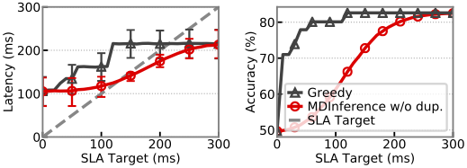
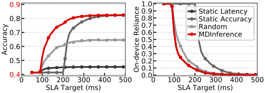

# MDInference
Repository for the MDInference paper published at IC2E'20.

## About

This repo is for the paper [MDInference: Balancing Inference Accuracy and Latency for Mobile Applications](https://arxiv.org/abs/2002.06603) in the proceedings of IC2E 2020.

This paper focuses on the need for making mobile deep inference frameworks truly mobile aware by considering the interplay of deep learning inference goals and mobile-specific constraints.
In addition we introduced our hypothetical framework, MDInference, that increased aggregate inference accuracy while bounding the latency of requests.
It does this by dynamically selecting high accuracy models in the cloud as well as duplicating inference execution on-device.

### Highlights

- Increased aggregate accuracy by over 7\% and up to 40\%.
- Demonstrated impact of varied network conditions.
- Introduced a holistic approach to mobile-aware framework design.

<div align="center"></div>

**Fig 1. Comparison of accuracy and latency between MDInference and a Greedy approach.**


<div align="center"></div>

**Fig 2. Comparison of accuracy and latency between MDInference and various static approach.**


## How to use the code
Please see the instructions in the `code` folder.

## Citation

When using this project please cite the original paper:

```
@inproceedings{Ogden2020,
  title={{MDInference: Balancing Inference Accuracy and Latency for Mobile Applications}},
  author={Samuel S Ogden and Tian Guo},
  booktitle={2020 IEEE International Conference on Cloud Engineering (IC2E)},
  year={2020},
  organization={IEEE}
}
```

## Acknowledgements

We would like to thank the National Science Foundation grants #1755659 and #1815619.


## Contact
* Samuel S. Ogden <ssogden@wpi.edu>
* Tian Guo <tian@wpi.edu>
